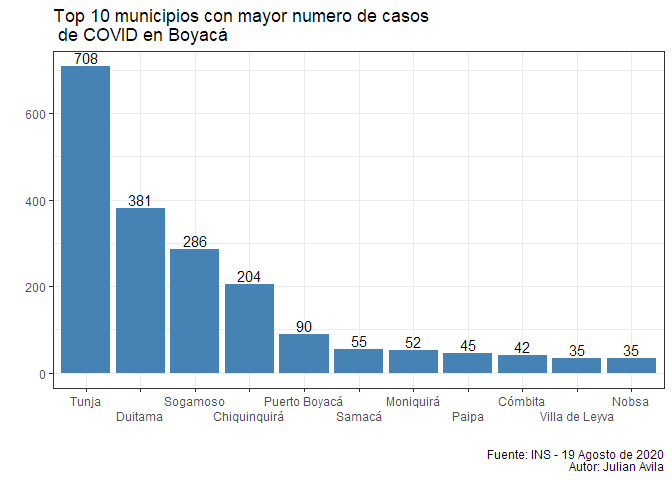
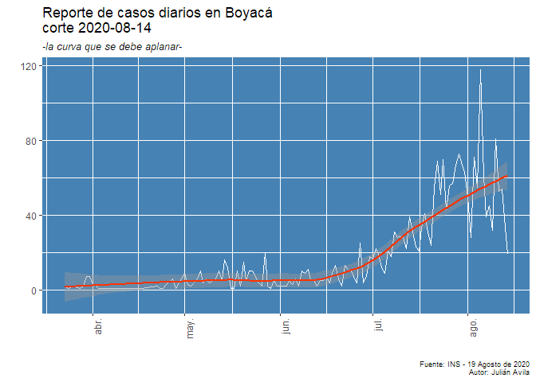
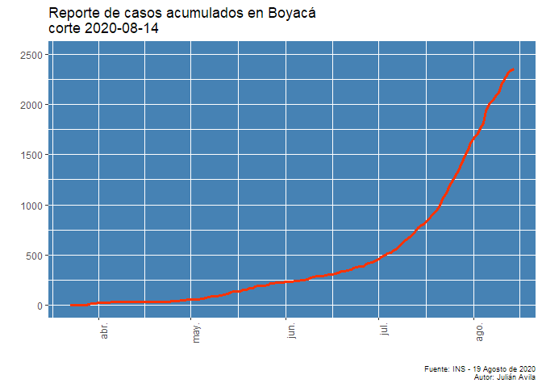
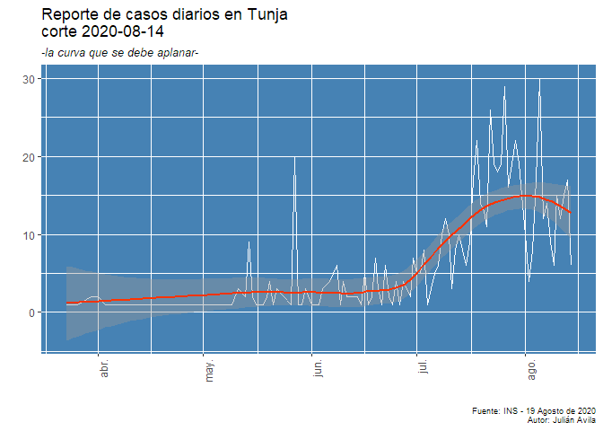
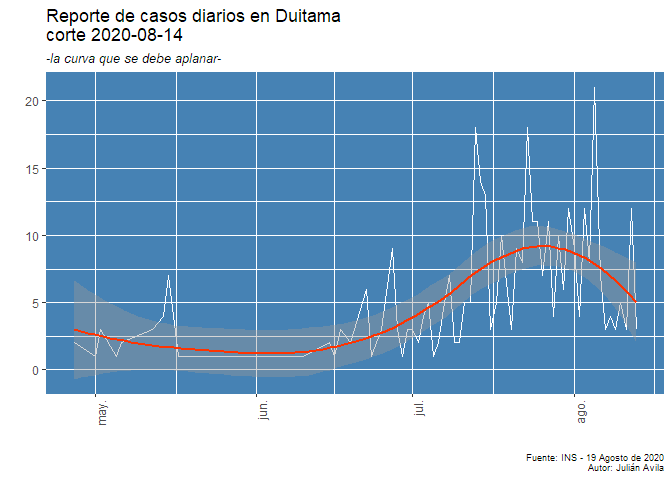
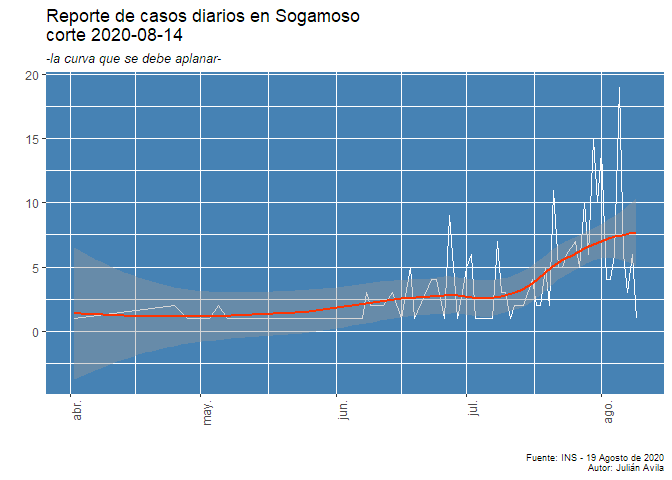
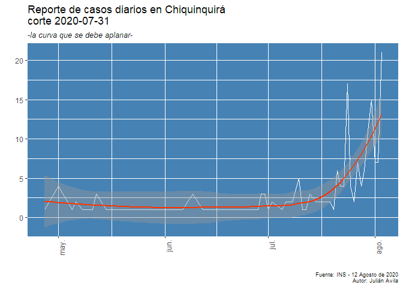
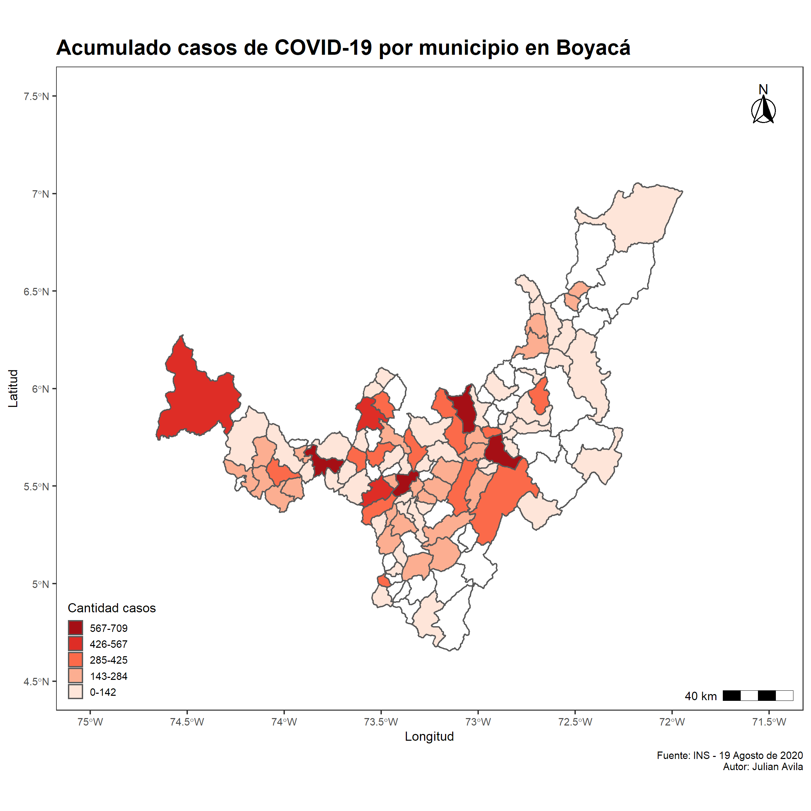

README
================
Julian Avila-Jimenez
19 agosto, 2020

## Análisis de casos de Covid19 en Boyacá.

Descarga los datos de de
[Covid19](https://www.datos.gov.co/Salud-y-Protecci-n-Social/Casos-positivos-de-COVID-19-en-Colombia/gt2j-8ykr/data)
de la pagina del Instituto Nacional de Salud

 

### Municipios con mayor número de casos del departamento.

<!-- -->

El número de casos por municipio esta directamente relacionado con la
población de cada municipio.

  

### Comportamiento de la curva de casos diarios en Boyacá.

<!-- -->

La curva muestra que aun nos encontramos en la fase de crecimiento.

  

### Comportamiento de la curva de casos acumulados en Boyacá.

<!-- -->

esta curva siempre tendrá un comportamiento exponencial.

 

### Comportamiento de la curva de casos diarios en Tunja.

<!-- -->

La curva muestra una desaceleración del crecimiento influenciada por
tres días de bajos registros.

 

### Comportamiento de la curva de casos diarios en Duitama.

<!-- -->

La curva muestra que empieza a aplanarse, este comportamiento esta
relacionado por seis días consecutivos de bajos reportes.

 

### Comportamiento de la curva de casos diarios en Sogamoso.

<!-- -->

La curva muestra que empieza a aplanarse, este comportamiento esta
relacionado por ocho días consecutivos de bajos reportes.

 

### Comportamiento de la curva de casos diarios en Chiquinquirá.

<!-- -->

La curva muestra una desaceleración del crecimiento influenciada por
tres días de bajos registros.

  

## Distribución de los casos en el departamento.

<!-- -->

  

### Tabla de casos por municipio

<table class="table table-striped table-hover table-condensed" style="width: auto !important; ">

<caption>

Fuente: INS - 19 Agosto de 2020

</caption>

<thead>

<tr>

<th style="text-align:left;position: sticky; top:0; background-color: #FFFFFF;position: sticky; top:0; background-color: #FFFFFF;">

Ciudad

</th>

<th style="text-align:right;position: sticky; top:0; background-color: #FFFFFF;position: sticky; top:0; background-color: #FFFFFF;">

Casos

</th>

</tr>

</thead>

<tbody>

<tr>

<td style="text-align:left;">

Tunja

</td>

<td style="text-align:right;">

708

</td>

</tr>

<tr>

<td style="text-align:left;">

Duitama

</td>

<td style="text-align:right;">

381

</td>

</tr>

<tr>

<td style="text-align:left;">

Sogamoso

</td>

<td style="text-align:right;">

286

</td>

</tr>

<tr>

<td style="text-align:left;">

Chiquinquirá

</td>

<td style="text-align:right;">

204

</td>

</tr>

<tr>

<td style="text-align:left;">

Puerto Boyacá

</td>

<td style="text-align:right;">

90

</td>

</tr>

<tr>

<td style="text-align:left;">

Samacá

</td>

<td style="text-align:right;">

55

</td>

</tr>

<tr>

<td style="text-align:left;">

Moniquirá

</td>

<td style="text-align:right;">

52

</td>

</tr>

<tr>

<td style="text-align:left;">

Paipa

</td>

<td style="text-align:right;">

45

</td>

</tr>

<tr>

<td style="text-align:left;">

Cómbita

</td>

<td style="text-align:right;">

42

</td>

</tr>

<tr>

<td style="text-align:left;">

Villa de Leyva

</td>

<td style="text-align:right;">

35

</td>

</tr>

<tr>

<td style="text-align:left;">

Nobsa

</td>

<td style="text-align:right;">

35

</td>

</tr>

<tr>

<td style="text-align:left;">

Aquitania

</td>

<td style="text-align:right;">

26

</td>

</tr>

<tr>

<td style="text-align:left;">

Ventaquemada

</td>

<td style="text-align:right;">

25

</td>

</tr>

<tr>

<td style="text-align:left;">

Pesca

</td>

<td style="text-align:right;">

22

</td>

</tr>

<tr>

<td style="text-align:left;">

Guateque

</td>

<td style="text-align:right;">

21

</td>

</tr>

<tr>

<td style="text-align:left;">

Sutamarchán

</td>

<td style="text-align:right;">

18

</td>

</tr>

<tr>

<td style="text-align:left;">

Togüí

</td>

<td style="text-align:right;">

17

</td>

</tr>

<tr>

<td style="text-align:left;">

Socha

</td>

<td style="text-align:right;">

16

</td>

</tr>

<tr>

<td style="text-align:left;">

Maripí

</td>

<td style="text-align:right;">

15

</td>

</tr>

<tr>

<td style="text-align:left;">

Viracachá

</td>

<td style="text-align:right;">

12

</td>

</tr>

<tr>

<td style="text-align:left;">

Firavitoba

</td>

<td style="text-align:right;">

11

</td>

</tr>

<tr>

<td style="text-align:left;">

Guacamayas

</td>

<td style="text-align:right;">

11

</td>

</tr>

<tr>

<td style="text-align:left;">

Soracá

</td>

<td style="text-align:right;">

11

</td>

</tr>

<tr>

<td style="text-align:left;">

San Pablo de Borbur

</td>

<td style="text-align:right;">

10

</td>

</tr>

<tr>

<td style="text-align:left;">

Garagoa

</td>

<td style="text-align:right;">

9

</td>

</tr>

<tr>

<td style="text-align:left;">

Siachoque

</td>

<td style="text-align:right;">

9

</td>

</tr>

<tr>

<td style="text-align:left;">

Arcabuco

</td>

<td style="text-align:right;">

8

</td>

</tr>

<tr>

<td style="text-align:left;">

Buenavista

</td>

<td style="text-align:right;">

8

</td>

</tr>

<tr>

<td style="text-align:left;">

Muzo

</td>

<td style="text-align:right;">

8

</td>

</tr>

<tr>

<td style="text-align:left;">

Soatá

</td>

<td style="text-align:right;">

8

</td>

</tr>

<tr>

<td style="text-align:left;">

Toca

</td>

<td style="text-align:right;">

8

</td>

</tr>

<tr>

<td style="text-align:left;">

Cucaita

</td>

<td style="text-align:right;">

7

</td>

</tr>

<tr>

<td style="text-align:left;">

Nuevo Colón

</td>

<td style="text-align:right;">

7

</td>

</tr>

<tr>

<td style="text-align:left;">

Briceño

</td>

<td style="text-align:right;">

6

</td>

</tr>

<tr>

<td style="text-align:left;">

Miraflores

</td>

<td style="text-align:right;">

6

</td>

</tr>

<tr>

<td style="text-align:left;">

Tibaná

</td>

<td style="text-align:right;">

6

</td>

</tr>

<tr>

<td style="text-align:left;">

Tibasosa

</td>

<td style="text-align:right;">

6

</td>

</tr>

<tr>

<td style="text-align:left;">

Úmbita

</td>

<td style="text-align:right;">

6

</td>

</tr>

<tr>

<td style="text-align:left;">

Zetaquira

</td>

<td style="text-align:right;">

6

</td>

</tr>

<tr>

<td style="text-align:left;">

Coper

</td>

<td style="text-align:right;">

5

</td>

</tr>

<tr>

<td style="text-align:left;">

El Espino

</td>

<td style="text-align:right;">

5

</td>

</tr>

<tr>

<td style="text-align:left;">

Quípama

</td>

<td style="text-align:right;">

5

</td>

</tr>

<tr>

<td style="text-align:left;">

Susacón

</td>

<td style="text-align:right;">

5

</td>

</tr>

<tr>

<td style="text-align:left;">

Tota

</td>

<td style="text-align:right;">

5

</td>

</tr>

<tr>

<td style="text-align:left;">

Belén

</td>

<td style="text-align:right;">

4

</td>

</tr>

<tr>

<td style="text-align:left;">

Cubará

</td>

<td style="text-align:right;">

4

</td>

</tr>

<tr>

<td style="text-align:left;">

Chíquiza

</td>

<td style="text-align:right;">

4

</td>

</tr>

<tr>

<td style="text-align:left;">

Guayatá

</td>

<td style="text-align:right;">

4

</td>

</tr>

<tr>

<td style="text-align:left;">

Monguí

</td>

<td style="text-align:right;">

4

</td>

</tr>

<tr>

<td style="text-align:left;">

Motavita

</td>

<td style="text-align:right;">

4

</td>

</tr>

<tr>

<td style="text-align:left;">

Santana

</td>

<td style="text-align:right;">

4

</td>

</tr>

<tr>

<td style="text-align:left;">

Caldas

</td>

<td style="text-align:right;">

3

</td>

</tr>

<tr>

<td style="text-align:left;">

Corrales

</td>

<td style="text-align:right;">

3

</td>

</tr>

<tr>

<td style="text-align:left;">

Pachavita

</td>

<td style="text-align:right;">

3

</td>

</tr>

<tr>

<td style="text-align:left;">

Santa Rosa de Viterbo

</td>

<td style="text-align:right;">

3

</td>

</tr>

<tr>

<td style="text-align:left;">

Turmequé

</td>

<td style="text-align:right;">

3

</td>

</tr>

<tr>

<td style="text-align:left;">

Boavita

</td>

<td style="text-align:right;">

2

</td>

</tr>

<tr>

<td style="text-align:left;">

Boyacá

</td>

<td style="text-align:right;">

2

</td>

</tr>

<tr>

<td style="text-align:left;">

Ciénega

</td>

<td style="text-align:right;">

2

</td>

</tr>

<tr>

<td style="text-align:left;">

Covarachía

</td>

<td style="text-align:right;">

2

</td>

</tr>

<tr>

<td style="text-align:left;">

Iza

</td>

<td style="text-align:right;">

2

</td>

</tr>

<tr>

<td style="text-align:left;">

Jenesano

</td>

<td style="text-align:right;">

2

</td>

</tr>

<tr>

<td style="text-align:left;">

Paya

</td>

<td style="text-align:right;">

2

</td>

</tr>

<tr>

<td style="text-align:left;">

Ramiriquí

</td>

<td style="text-align:right;">

2

</td>

</tr>

<tr>

<td style="text-align:left;">

Saboyá

</td>

<td style="text-align:right;">

2

</td>

</tr>

<tr>

<td style="text-align:left;">

Santa Sofía

</td>

<td style="text-align:right;">

2

</td>

</tr>

<tr>

<td style="text-align:left;">

Tenza

</td>

<td style="text-align:right;">

2

</td>

</tr>

<tr>

<td style="text-align:left;">

Tinjacá

</td>

<td style="text-align:right;">

2

</td>

</tr>

<tr>

<td style="text-align:left;">

Tópaga

</td>

<td style="text-align:right;">

2

</td>

</tr>

<tr>

<td style="text-align:left;">

Tuta

</td>

<td style="text-align:right;">

2

</td>

</tr>

<tr>

<td style="text-align:left;">

Chita

</td>

<td style="text-align:right;">

1

</td>

</tr>

<tr>

<td style="text-align:left;">

Cuítiva

</td>

<td style="text-align:right;">

1

</td>

</tr>

<tr>

<td style="text-align:left;">

Gámeza

</td>

<td style="text-align:right;">

1

</td>

</tr>

<tr>

<td style="text-align:left;">

Jericó

</td>

<td style="text-align:right;">

1

</td>

</tr>

<tr>

<td style="text-align:left;">

La Uvita

</td>

<td style="text-align:right;">

1

</td>

</tr>

<tr>

<td style="text-align:left;">

Oicatá

</td>

<td style="text-align:right;">

1

</td>

</tr>

<tr>

<td style="text-align:left;">

Otanche

</td>

<td style="text-align:right;">

1

</td>

</tr>

<tr>

<td style="text-align:left;">

Pajarito

</td>

<td style="text-align:right;">

1

</td>

</tr>

<tr>

<td style="text-align:left;">

Pauna

</td>

<td style="text-align:right;">

1

</td>

</tr>

<tr>

<td style="text-align:left;">

Ráquira

</td>

<td style="text-align:right;">

1

</td>

</tr>

<tr>

<td style="text-align:left;">

San José de Pare

</td>

<td style="text-align:right;">

1

</td>

</tr>

<tr>

<td style="text-align:left;">

San Miguel de Sema

</td>

<td style="text-align:right;">

1

</td>

</tr>

<tr>

<td style="text-align:left;">

Santa María

</td>

<td style="text-align:right;">

1

</td>

</tr>

<tr>

<td style="text-align:left;">

Sativasur

</td>

<td style="text-align:right;">

1

</td>

</tr>

<tr>

<td style="text-align:left;">

Sotaquirá

</td>

<td style="text-align:right;">

1

</td>

</tr>

<tr>

<td style="text-align:left;">

Tasco

</td>

<td style="text-align:right;">

1

</td>

</tr>

<tr>

<td style="text-align:left;">

Tipacoque

</td>

<td style="text-align:right;">

1

</td>

</tr>

</tbody>

</table>

##  

Elaborado en  

<!-- -->

[RMarkdown](https://rmarkdown.rstudio.com/)

Ultima vez actualizado en “19 agosto, 2020”.
